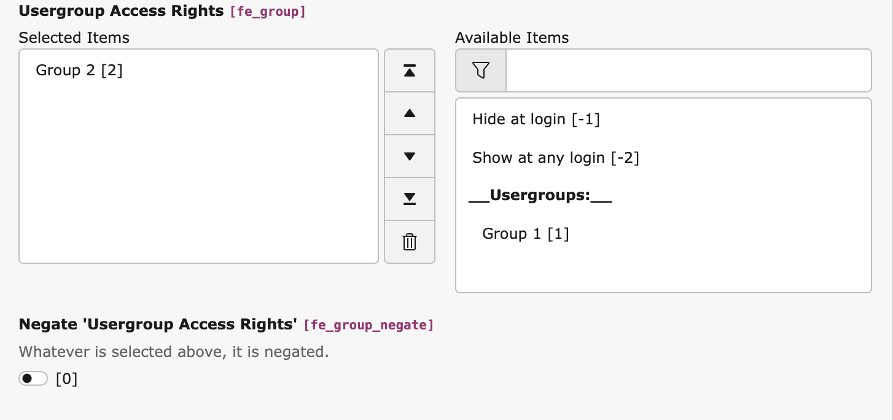

# TYPO3 Extension `inverted_usergroup_action`

**Heavily work in progress**

This extension provides the possibility to negate the usergroup permissions in records.



## Usage

Use `composer req georgringer/inverted-usergroup-access` to install this extension.

Define the tables you want to use the negation in the Extension's settings.

### Providing the TCA

To use this in custom tables except `tt_content` and `pages`, you need to provide the TCA yourself:

```php
<?php
$columns = [
    'fe_group_negate' => [
        'label' => 'LLL:EXT:inverted_usergroup_access/Resources/Private/Language/locallang.xlf:field.fe_group_negate',
        'description' => 'LLL:EXT:inverted_usergroup_access/Resources/Private/Language/locallang.xlf:field.fe_group_negate.description',
        'config' => [
            'type' => 'check',
            'renderType' => 'checkboxToggle',
        ]
    ]
];

$yourTableName = 'tx_your_table';
\TYPO3\CMS\Core\Utility\ExtensionManagementUtility::addTCAcolumns($yourTableName, $columns);

// if you got a palette called `access`, you can add it in the palette
\TYPO3\CMS\Core\Utility\ExtensionManagementUtility::addFieldsToPalette('tt_content', 'access', '--linebreak--,fe_group_negate', 'after:fe_group');
// or add it directly to the list of fields
\TYPO3\CMS\Core\Utility\ExtensionManagementUtility::addToAllTCAtypes($yourTableName, 'fe_group_negate', '', 'after:fe_group');
```
